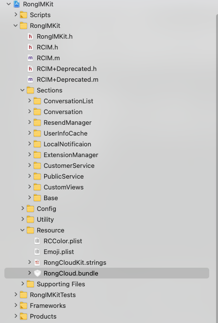
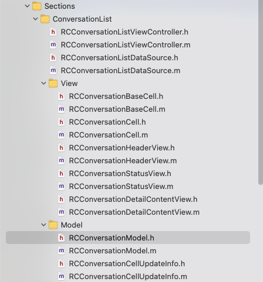
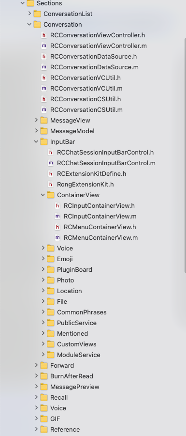

###1. 设计说明
IMKit SDK 5.0 及以上版本开放了源代码，支持以源码形式进行调试与集成，源码集成参考

::: tip 温馨提示：
对于开发者自定义 UI 的需求，有以下建议

1.不建议直接修改源码内容，防止后续源码升级将修改内容覆盖

2.建议通过继承重写某些类与自身逻辑不一致的方法，来增加新方法以扩展自身的业务逻辑

3.建议使用 SDK 对外暴露的接口，如果调用私有接口可能会出现版本升级引起私有接口变更
:::

####1.1 目录介绍

IMKit 目录以及对应功能介绍（以下说明中的目录对应 IMKit 5.0.0 版本)



以下着重介绍 RongIMKit 目录

```objectivec
RongIMKit
├── RongIMKit.h (头文件索引)
├── RCIM (核心类)
├── RCIM+Deprecated (核心类中废弃接口)
├── Sections
│       ├── ConversationList (会话列表)
│       ├── Conversation   (会话页面)
│       ├── ResendManager (消息自动重发)
│       ├── UserInfoCache (用户信息缓存)
│       ├── LocalNotificaion (本地通知)
│       ├── ExtensionManager (供其他库扩展)
│       ├── CustomerService (客服)
│       ├── PublicService (公众号)
│       ├── CustomViews (通用 view)
│       └── Base (子类)
├── Config (各种开关配置)
├── Utility (工具类)
│       ├── Extension (扩展属性)
│       ├── Categories (类目)
│       ├── Pinyin (第三方)
│       ├── RCloudImageLoading (第三方)
│       ├── MBProgressHUD (第三方)
│       ├── FMDB (第三方)
│       └── MJRefresh (第三方)
└── Resource (语言包，资源文件)
```
####1.2 IMKit 主要类介绍：

#####会话列表：

 

```objectivec
ConversationList
├── RCConversationListViewController (会话列表 VC)
├── RCConversationListDataSource (会话列表数据处理)
├── View
│       ├── RCConversationBaseCell (会话列表 Cell 基类)
│       ├── RCCconversationCell   (会话列表 Cell )
│       ├── RCConversationHeaderView (Cell 中头像相关 view，包含头像，角标)
│       ├── RCConversationStatusView (会话状态 View，包括会话免打扰，最后一条单聊消息阅读状态)
│       └── RCConversationDetailContentView (当前会话最后一条消息内容 view)
└── Model 
│       ├── RCConversationModel (会话 model)
│       └── RCConversationCellUpdateInfo (会话更新 model)
```

#####会话：



```objectivec
Conversation
├── RCConversationViewController (会话 VC)
├── RCConversationDataSource (会话数据处理)
├── RCConversationVCUtil (会话工具类)
├── RCConversationCSUtil (客服会话处理)
├── MessageView (各种消息对应 cell 及 cell 中自定义 view)
├── MessageModel (会话数据 model)
├── InputBar ( 输入框)
│       ├──  RCChatSessionInputBarControl (键盘核心类)
│       ├── RCExtensionKitDefine   (键盘相关枚举)
│       ├── ContainerView (容器视图)
│       │      ├── RCInputContainerView （普通键盘）
│       │      └── RCMenuContainerView (公众号键盘)
│       ├── Voice （录制语音）
│       ├── Emoji （表情面板）
│       ├── PluginBoard （加号扩展面板）
│       ├── Photo （相册选择图片）
│       ├── Location （选择位置）
│       ├── File （选择文件）
│       ├── CommonPhrases （常用语）
│       ├── PublicService （公众号）
│       ├── Mentioned （@ 选人）
│       ├── CustomViews （通用 view）
│       └── ModuleService (第三方厂商扩展模块使用）
├── Forward (转发)
├── BurnAfterRead (阅后即焚)
├── MessagePreview (各种消息的预览)
├── Recall (撤回)
├── Voice (语音)
└── Reference (引用消息相关)
```
###2. 源码集成
参考[官网源码集成文档](https://docs.rongcloud.cn/v4/5X/views/im/ui/guide/quick/include/ios.html#%20IMKit%20源码集成)